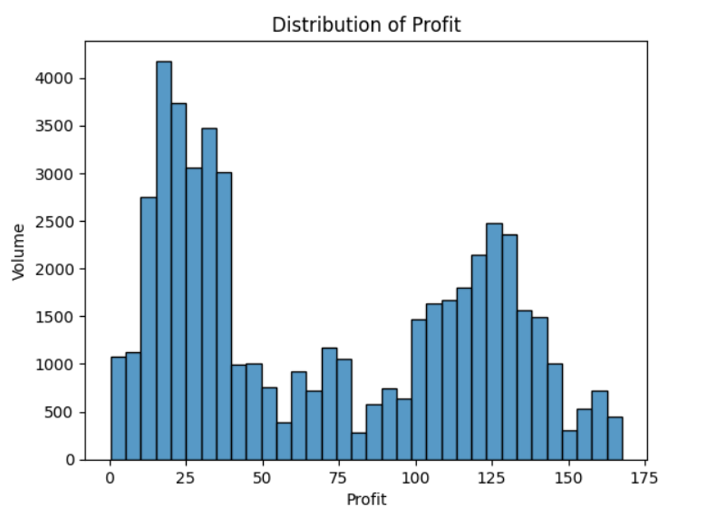
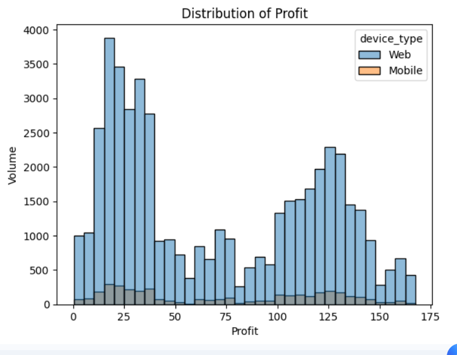
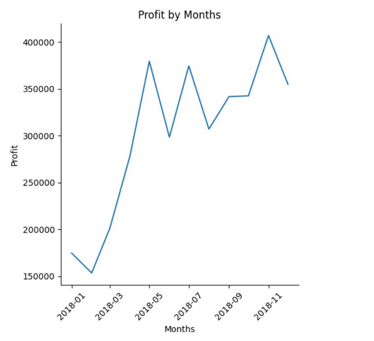
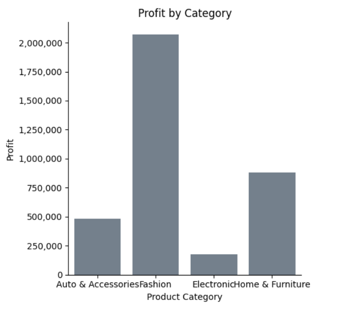
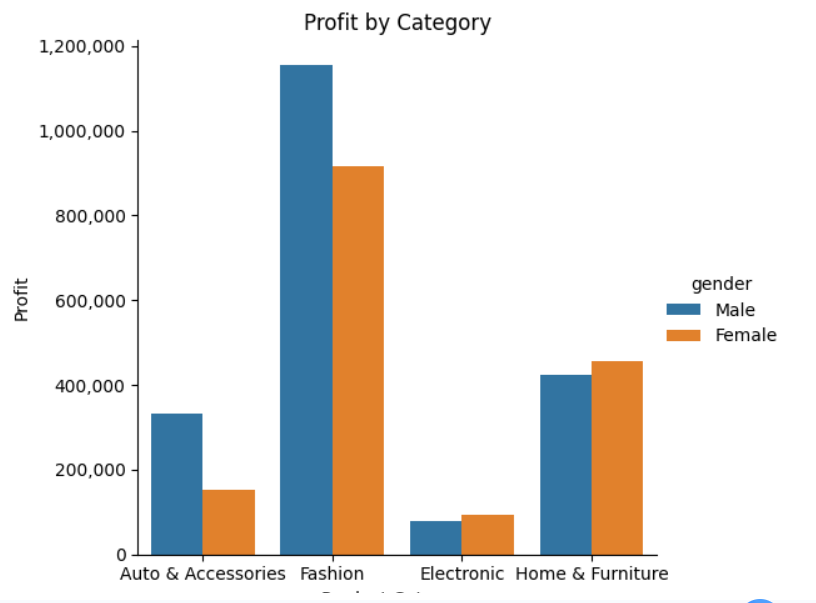

# Profit Analysis with Seaborn

## Project Overview

This project explores sales data using Python (Pandas, NumPy) and visualizations (Seaborn, Matplotlib).
The goal is to analyze the distribution of profits, compare sales across devices, monitor profit trends over time, and investigate revenue patterns by product category and customer gender.

## Tools & Libraries

- Python

- Pandas

- NumPy

- Matplotlib

- Seaborn

## Dataset

The dataset contains 51,290 records of sales with the following key columns:

- `order_date` – date of the order

- `profit` – profit per order

- `device_type` – Web or Mobile

- `product_category` – category of the product

- `gender` – gender of the customer

## Analysis & Key Insights

### Profit Distribution

- The distribution is asymmetric with peaks and valleys.

- The largest peaks are found in the ranges **10–40** and **120–130**.

- There are a few high-profit outliers.



### Profit by Device Type

- **Web** accounts for the vast majority of sales volume.

- **Mobile** represents a significantly smaller share of transactions.

- The profit distribution shape is similar across both channels, but Web dominates in absolute numbers.



### Profit Trends Over Time

- There is a **general increasing trend** in monthly profits.

- Since April 2018, monthly profits exceed 250,000.

- Peak profits occurred in **November 2018** (~405,000).



### Profit by Product Category

- Most profitable category: **Fashion** (~2,070,000)

- Least profitable category: **Electronics** (~180,000)



### Profit by Product Category & Gender

- Men generate higher profit in **Auto & Accessories** and **Fashion**.

- In **Home & Furniture**, female profit is slightly higher than male.

- **Electronics** shows relatively similar profit for both genders.



## How to Run

1. Clone this repository

2. Install dependencies:

```bash
pip install -r requirements.txt
```

3. Open [`Profit_Analysis_with_Seaborn.ipynb`](Profit_Analysis_with_Seaborn.ipynb) in Jupyter Notebook or Google Colab

## Project Structure

```
profit-analysis-with-seaborn/
├── images/
│   ├── profit_distribution.png
│   ├── profit_by_device.png
│   ├── profit_by_month.png
│   ├── profit_by_category.png
│   └── profit_by_category_gender.png
├── Profit_Analysis_with_Seaborn.ipynb
├── requirements.txt
└── README.md
```
